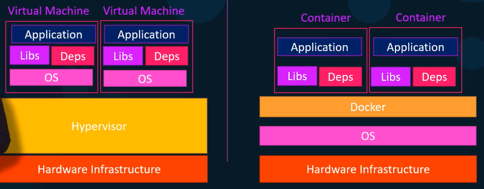
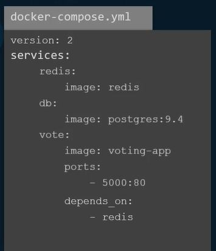
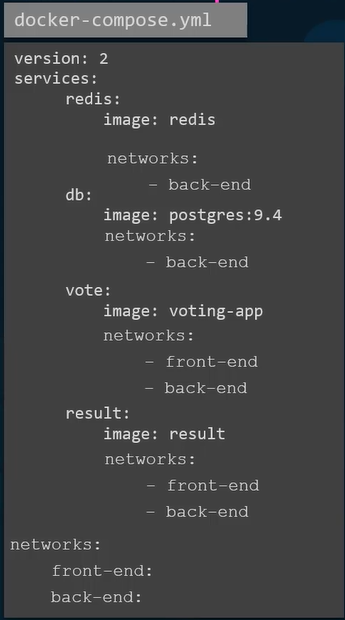

# what is docker
Docker is is a tool which helps in making a application as a platform indipenednt. A applicaiton made using docker can run easily on any operating system.

## Difference between virtual machine and docker container

Each virtula machine has seprate operating system.But multiple docker container can share single operating system. Multiple docker container can run on a share os without interfaring each other.




## Docker commands

* list running Docker containers 
    ```
    docker ps 
    ```
* lists all Docker containers 
    ```
    docker ps -a
    ```
* stop a running Docker container
    ```
    docker stop container_id
    ```
* Remove a Stopped Container permanently
    ```
    docker rm container_name
    ```
`
* List availbel images 
    ```
    docker images
    ```
* remove image
    ```
    docker rmi image_name
    ```
* pull image
    ```
    docker pull image_name
    ```
* run container from image
    ```
    docker run image_name
    ```

* enter into a container
    ```
    docker exec -it container_id /bin/bash
    ```
* print details of container in json formate
    ```
    docker inspect container_id
    ```
* View the logs of running container
    ```
    docker logs container_id
    ```
## Need of docker volume
Containers are ephemeral means-when they stop or are deleted, all data inside is container lost.Volue map the directory inside a container to the directory outside the container.So that when container is stoped or removed data will be persist in external directory.

```
docker run -d -v shared_data:/app/data app
```

in above we are running container and maped a shared_data directory of outside container to the directory inside container /app/data app

## Layers in docker image
When you build a Docker image, every instruction in the Dockerfile generates a new read-only layer. These layers are stacked on top of each other to form the final image

```
FROM ubuntu:22.04               # Layer 1: Base image
RUN apt-get update              # Layer 2: Updates package lists
RUN apt-get install -y curl     # Layer 3: Installs `curl`
COPY app.py /app/               # Layer 4: Adds a file
CMD ["python3", "/app/app.py"]  # Layer 5: Sets the default command (metadata)
```
* Docker caches layers while building image
* If a layer hasn’t changed, Docker reuses the cached layer instead of rebuilding layer again.
* Optimization Tip: Order commands from least to most frequently changed (e.g., install dependencies before copying code).
* est Practice: Combine related RUN commands to reduce layers 


# Docker compose file

Docker compose is used to run multiple container together.It also allow us to use depend_ond tag which runs a perticular container after a container start successfully.


### define network of each service 
